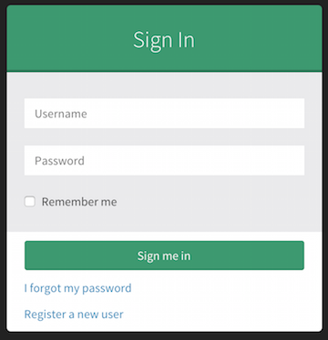
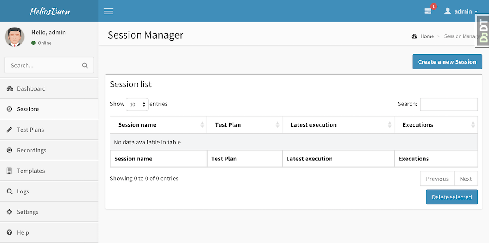
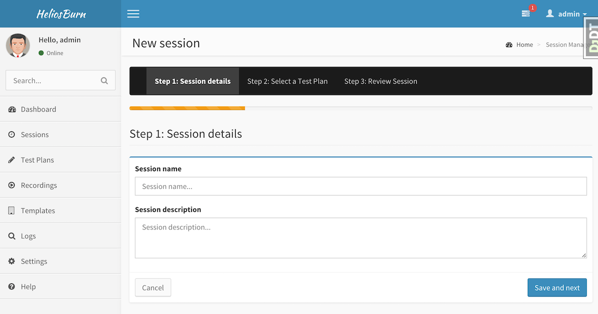

# Getting started with Helios Burn

To deploy Helios Burn, you have several options: [Docker](https://www.docker.com), [Vagrant](https://www.vagrantup.com/), or a virtual machine on a platform of your choice. This guide will focus on Vagrant. The purpose of this guide is to get you up and running as quickly as possible, and does not cover all the of the options for deployment and configuration. Please refer to the [Helios Burn documentation](../) to learn more.

## Steps of this guide

1. [Getting Vagrant](#getting-vagrant)
*  [Getting Helios Burn](#getting-helios-burn)
*  [Setting up Helios Burn](#setting-up-your-helios-burn-system-with-vagrant)
*  [Using Helios Burn](#using-helios-burn)

### Getting Vagrant

1. [Download and install Virtualbox](https://www.virtualbox.org/wiki/Downloads)
*  [Download and install Vagrant](http://www.vagrantup.com/downloads.html)

### Getting Helios Burn

You can download Helios Burn from Github using [Git](https://github.com/emccode/HeliosBurn/archive/master.zip) or a direct [HTTP download](https://github.com/emccode/HeliosBurn/archive/master.zip). To clone Helios Burn with `git`, type the following in a terminal:

```
git clone git@github.com:emccode/HeliosBurn.git --recursive
```
__WARNING__: Make sure you include the `--recursive` option above! Otherwise Vagrant will fail to provision our environment.

### Setting up your Helios Burn system with Vagrant

After cloning Helios Burn, enter the directory by typing the following in a terminal:

```
cd HeliosBurn
```

Now launch the Vagrant environment by typing the following in your terminal:

```
vagrant up
```
__NOTE__: Depending on the speed of your computer, this step may take several minutes. This will download, build, and setup the guest operating system to contain Helios Burn.

After your Vagrant is complete, run the following commands in your terminal to install Helios Burn within your Vagrant.

```
vagrant ssh
cd HeliosBurn
sudo ./install_in_vagrant.sh
```

After this, your Vagrant will reboot, and Helios Burn will be started. You can login on your _host_ OS at [http://localhost:8100](http://localhost:8100).

### Using Helios Burn

1. [Logging in](#logging-in)
*  [The dashboard](#the-dashboard)
*  [The session manager](#the-session-manager)
*  [Creating a new session](#creating-a-new-session)

##### Logging in
On your local host, browse to [http://localhost:8100](http://localhost:8100), you should see the following login screen. Login with username *admin*, and password *admin*.



##### The dashboard
After logging in, you will see the dashboard. From the dashboard, click 'Sessions' on the left. This will take you to the session manager.


##### The session manager

The session manager allows you to create and manage testing sessions. From the session manager, click 'Create new session'.




##### Creating a new session

Get started with a new session by entering some details.
Enter 'test session' for the name, and a description of your choice, then click 'Save and next'.




