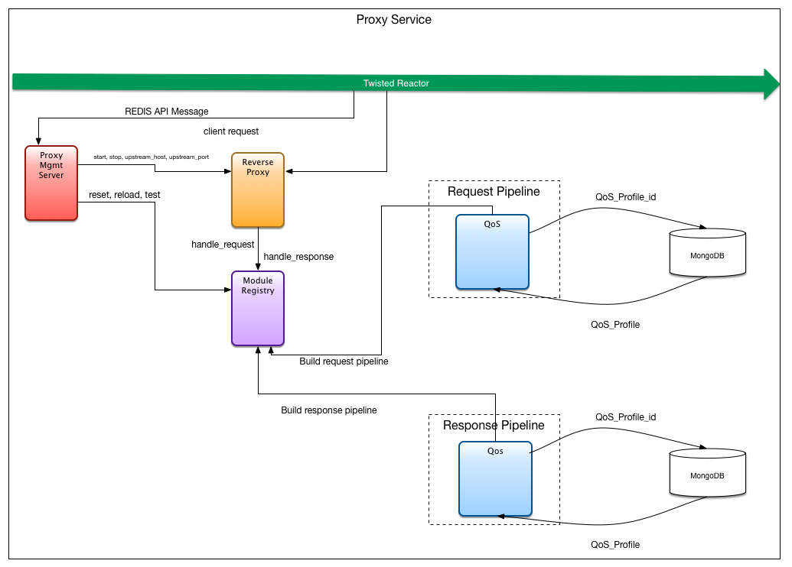

- [Quality of Service Module](#quality-of-service-odule)
  - [QoS Profile](#qos-profile)
  - [Latency](#latency)
  - [Jitter](#jitter)
  - [Packet Loss](#packet-loss)

# Quality of Service Module

  


# QOS Module

The QOS module is situated inside the proxy processing pipline so as to apply a given QoS profile to proxy traffic.
When the QoS module is started the given `session_id` is used to retrieve the QoS profile from `mongo`.
When the module receives a response or request, each QoS quality is applied to the traffic as defined by the retrieved QoS profile.

## QoS Profile

 The QoS profile can currently support three service quality types: latency, jitter and traffic loss.
Three qualities are implemented and applied to the http proxy traffic with the parameters given by the QoS_profile as follows:

| Feature      | Context | Description                                                                                                           |
|:------------|:--------|:----------------------------------------------------------------------------------------------------------------------|
| Latency     | request | Injectes a constant wait time into the the traffic stream so as to increase the round-trip time of each request       |
| Jitter      | request | Injects random wait time into the traffic stream so as to increase the round-trip time of each request inconsistently |
| Packet Loss | both    | Drops requests/responses randomly                                                                                     |
|             |         |                                                                                                                       |
### Example JSON representation:

```json
{
    "latency": 100,
    "jitter": {
        "min": 30,
        "max": 50
    },
    "trafficLoss": 0.1
}
```
E.g. trafficLoss=0.1 means that the module will drop 10% of the traffic.

E.g. latency=100ms and jitter(min=30ms, max=50ms) means that latency will vary from 70ms to 150ms.

## Latency

The `latency` quality has the following parameters.

| Element | Context | Description                                                     |
|:--------|:--------|:----------------------------------------------------------------|
| delay   | request | The delay, in miliseconds, the module will inject. |
|

## Jitter

The `Jitter` quality has the following parameters.

| Element | Context | Description                                                     |
|:--------|:--------|:----------------------------------------------------------------|
| maximum | request | The maximum amount of delay, in miliseconds, the module will inject. |
| minimum | request | The minimum amount of delay, in miliseconds, the module will inject. |

## Packet Loss

The `Packet Loss` quality has the following parameters.

| Element | Context | Description                                                         |
|:--------|:--------|:--------------------------------------------------------------------|
| chance  | both    | The percentage chance that any given request/response will be lost. |
