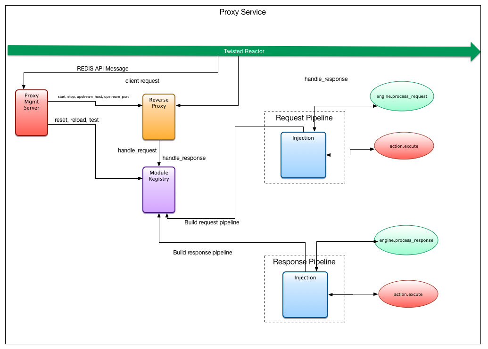

- [QOS](#qos)
  - [](#injection-engine)
  - [Injection Interface](#injection-interface)
  - [Injection Module](#injection-module)


# Quality of Service Module

  


# Injection Interface

## Engine mockup for fault injection

Explaining arguments to `process_request(http_metadata, session)`

## http_metadata

`http_metadata` Request example:
```json
  "request": {
    "url": "http://foo.com",
    "httpProtocol": "HTTP/1.1",
    "method": "POST",
    "headers": [
      ["Content-Length", "way too long"],
      ["....", "...."]
    ]
  }
```

`http_metadata` Response example:
```json
  "request": {
    "url": "http://foo.com",
    "httpProtocol": "HTTP/1.1",
    "method": "POST",
    "headers": [
      ["Content-Length", "way too long"],
      ["....", "...."]
    ]
  },
  "response": {
    "httpProtocol": "HTTP/1.1",
    "statusCode": 200,
    "statusDescription": "OK",
    "headers": [
      ["Content-Length", "way too long"],
      ["....", "...."]
    ]
  }
```

## session

`session` example:

```json
  "id": 123,
```

# Return values to process_request(...)

## If a rule matches

Returns the `action` component of a `rule` in database.

## If a rule does not match

Returns `None`.


# QOS Module

The QOS module is situated inside the proxy processing pipline as the last module to process a request or a response. When the module receives a response or request, the corresponding metadata is passed to the injection engine for analysis. The injection engine then provides to the module the `action` component of the `rule` database or `None` if no rule matches.

The following possible actions are implemented as command objects and executed if the corresponding action type is returned by the injection engine:

| Action      | Context | Description                                                                                                                                                                                                              |
|:------------|:--------|:-------------------------------------------------------------------------------------------------------------------------------------------------------------------------------------------------------------------------|
| modify      | both    | Modifies different aspects of a given request or response.                                                                                                                                                               |
| newResponse | both    | Generates a completely new response independently of the given request or response. Note that if used in the `request` context it will directly respond to the client without even forwarding the request to the server. |
| newRequest  | request | Generates a completely new request independently of the given request.                                                                                                                                                   |
| drop        | both    | Drops the HTTP connection.                                                                                                                                                                                               |
| reset       | both    | Resets the HTTP connection.                                                                                                                                                                                              |


## JitterAction

An action type `modify` contains the following elements depending on the traffic context.

| Element           | Context  | Description                                                 |
|:------------------|:---------|:------------------------------------------------------------|
| httpProtocol      | both     | HTTP protocol.                                              |
| method            | request  | Request method.                                             |
| url               | request  | Request URL.                                                |
| statusCode        | response | Status Code.                                                |
| statusDescription | response | Status description.                                         |
| setHeaders        | both     | List of headers to be set to the request or response.       |
| deleteHeaders     | both     | List of headers to be deleted from the request or response. |

### Example injection engine response

```json
"action": {
    "type": "modify",
    "method": "PUT",
    "setHeaders": [
        {
            "key": "X-Auth-Token",
            "value": "k54l3b6k6b43l56b346"
        }
    ],
    "deleteHeaders": [
        {
            "key": "User-Agent"
        }
    ]
}
```

## Action

An action type `newResponse` contains the following elements.

| Element           | Description         |
|:------------------|:--------------------|
| httpProtocol      | HTTP protocol.      |
| statusCode        | Status Code.        |
| statusDescription | Status description. |
| headers           | List of headers.    |
| payload           | Response payload.   |

### Example `injection engine` `newResponse` response

```json
"action": {
    "type": "newResponse",
    "httpProtocol": "HTTP/1.1",
    "statusCode": 400,
    "statusDescription": "Bad Request"
    "headers": [
        {
            "key": "E-Tag",
            "value": "9384253245"
        },
        {
            "key": "Server",
            "value": "HeliosBurn"
        }
    ],
    "payload": "Intercepted by HeliosBurn"
}
```

## NewRequestAction

An action type `newRequest` contains the following elements.

| Element      | Description      |
|:-------------|:-----------------|
| httpProtocol | HTTP protocol.   |
| method       | Request method.  |
| url          | Request URL.     |
| headers      | List of headers. |
| payload      | Request payload. |

## dropAction

The action type `drop` has no elements

### Example `injection engine` response
```json
"action": {
    "type": "drop",
}
```

## resetAction

The action type `reset` has no elements

### Example `injection engine` response
```json
"action": {
    "type": "reset",
}
