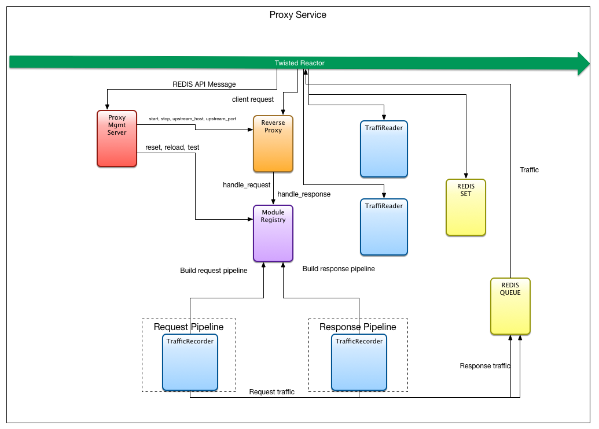

- [Proxy Recording](#proxy-recording)
  - [Recording traffic](#recording-traffic)
  - [Traffic Reader](#traffic-reader)
  - [Traffic Recorder](#traffic-recorder)
  - [Traffic Streamer](#traffic-streamer)


# Proxy Recording



The proxy service records and streams traffic using three different modules:

1. The `TrafficReader` - Publishes request and response traffic to a REDIS queue.
2. The `TrafficRecorder` - Pulls requests and responses traffic from a REDIS queue and stores them in a mongodb cluster.
3. The `TrafficStreamer` - Pulls requests and response traffic from a REDIS queue and places it in a REDIS stored set.

In general these modules are twisted plugins that have been added to the proxy modules directory. Once added to the modules directory they will be loaded on start-up of the proxy service. These modules can be activated by placing them in the `modules.yaml` file or started directly via the proxy service API. `TrafficReader` is considered a pipline module, as it is part of the request/response pipline processing. It should be added to the `pipline` section of the `modules.yaml` file. The other two should be added to the `support` section of the file.

```yaml
pipeline:
  [
    {
      name: 'TrafficReader',
      kwargs:
      {
        redis_host: '127.0.0.1',
        redis_port: 6379,
        redis_db: 0,
        redis_pub_queue: 'heliosburn.traffic',
      }
    },
 ]
 support:
   [
     {
       name: 'TrafficRecorder',
       kwargs:
       {
         redis_host: '127.0.0.1',
         redis_port: 6379,
         redis_sub_queue: 'heliosburn.traffic',
         mongo_host: '127.0.0.1',
         mongo_port: '27017',
         mongo_db: 'proxy',
         mongo_collection: 'traffic',
       }
     },
     {
       name: 'TrafficStream',
       kwargs:
       {
         redis_host: '127.0.0.1',
         redis_port: 6379,
         redis_db: 0,
         redis_key: 'heliosburn.traffic',
         redis_sub_queue: 'heliosburn.traffic',
       }
     }
   ]
```


#Traffic Reader

When clients send traffic to the reverse proxy, the request pipeline is loaded and incoming requests are fed through from one module to the next. The first module is the `TrafficReader` and it will publish the request to the REDIS queue. When the upstream host responds, the reader is the last module to receive the response and then it is published along with the original request to the REDIS queue.

```python
61     def handle_request(self, request):
62
63         message = self._get_traffic_message(request)
64         message['request'] = self._get_request_message(request)
65
66         self.redis_client.publish(self.redis_pub_queue, json.dumps(message))
67         log.msg("traffic read: " + message)
68         return request
69
70     def handle_response(self, response):
71
72         message = self._get_traffic_message(response)
73         message['request'] = self._get_request_message(response)
74         message['response'] = self._get_response_message(response)
75
76         self.redis_client.publish(self.redis_pub_queue, json.dumps(message))
77         log.msg("traffic read: " + message)
78         return response
```

#Traffic Recorder

The `TrafficRecorder` module subscribes to the REDIS queue that the `TrafficReader` publishes request and response traffic. When a message is posted to the queue, the `TrafficRecorder` will store the traffic message to the mongoDB cluster.

```python
53     def start(self, **params):
54         handler_factory = TrafficRecorderHandlerFactory(TrafficHandler)
55         handler_factory.set_recording_id(params['recording_id'])
56         self.redis_endpoint = TCP4ClientEndpoint(reactor,
57                                                  self.redis_host,
58                                                  self.redis_port)
59         self.channel = self.redis_sub_queue
60         d = self.redis_endpoint.connect(HBRedisSubscriberFactory(self.channel,  
61                                         handler_factory))
62
63         d.addCallback(self._subscribe)
64         self.state = "running"
65         self.status = datetime.datetime.now()
```


Each traffic message is stored as an individual document associated with a recording id as follows:


```python
Recording document
==================

{
    "_id": "Recording ID", <-- generated by MongoDB (ObjectId)
    "name": "Foo",
    "description": "Bar",
    "createdAt": "2015-03-11 00:00:00",
    ...
}


Recording Traffic document
==========================

{
    "_id": "Traffic ID", <-- generated by MongoDB (ObjectId)
    "recordingId": "Recording ID", <-- FK to Recording document (ObjectId)
    "transactionId": "transaction_UUID1", <-- generated by the Proxy (Ensure Index)
    "createdAt": "2015-03-11 00:00:00",
    "request": {
        "method": "GET",
        "url": "http://foo.bar",
        ...
    },
    "response": {
        "statusCode": 200,
        "statusDescription": "OK",
        ...
    }
}
```

#Traffic Streamer

The `TrafficStreamer` module subscribes to the REDIS queue that the `TrafficReader` publishes request and response traffic. When a message is posted to the queue, the `TrafficStreamer` then places the traffic in a REDIS set.

```python
18     def execute(self):
19         r = redis.StrictRedis(host=self.configs['redis_host'],
20                               port=self.configs['redis_port'],
21                               db=self.configs['redis_db'])
22         redis_key = self.configs['redis_key']
23
24         score = self._get_current_time()
25
26         # Remove traffic older than 1 second
27         result = r.zremrangebyscore(redis_key, '-inf',
28                                     score - 1 * 1000000)
29         self.log.msg('* Cleaned %d messages' % (result,))
30
31         result = r.zadd(redis_key, score, self.message)
32         if result:
33             self.log.msg('* Message with score %d sent successfully'
34                          % (score,))
35         else:
36             self.log.msg('Could not send message (%d)' % (score,))

```
