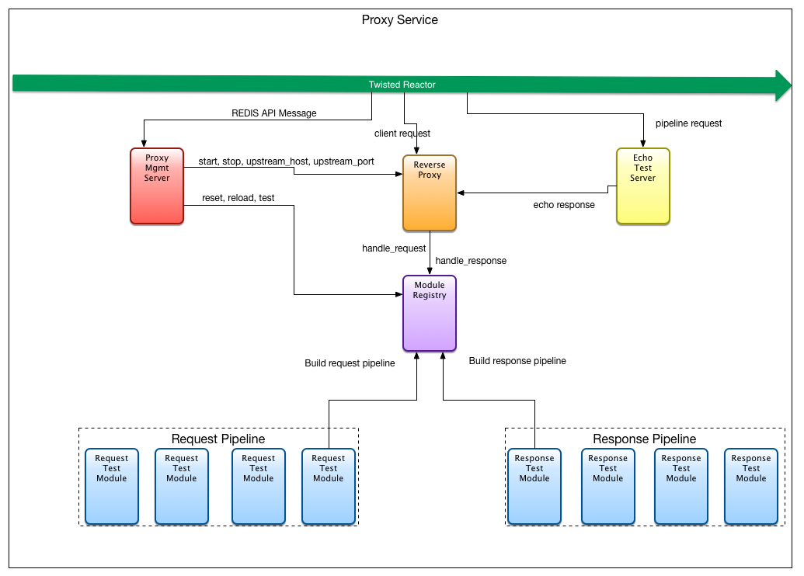

- [Proxy Testing](#proxy-testing)
  - [Running tests](#running-test)
  - [Adding Service API Tests Cases](#adding-service-api-tests-cases)
  - [Adding Pipeline Test Cases](#adding-pipeline-test-cases)


# Proxy Testing




In general proxy tests are twisted plugins that have been added to the proxy modules directory.
Once added to the modules directory they will be loaded on start-up of the proxy service.
To make use of the tests they then must be added to the `test` section of `modules.yaml` or be referenced directly through the proxy service API.

When executing test cases the proxy service operates as follows:

1. Put the proxy service into test mode
2. If no test case module is specified Execute the `start` method of all test case modules loaded from the `modules.yaml` file
3. if a test case module file is specified, execute the `start` method of the specified test case module.
4. Take the proxy service out of test mode.

### Test Mode
Currently test mode simply means two things:
1. test case modules are "plugged" into the request/response processing pipline instead of the normally configured modules used to handle traffic record, fault injection, etc... .
2. The upstream host that the proxy points to will be configured to be an internally running echo server, specifically for testing.

When the proxy service is taken out of test mode, the normally configured pipeline processing modules are "plugged" back into the request/response processing pipeline and return the upstream host to what it was before pointing at the echo server.

### Test Cases
Currently there are two types of proxy test cases. Those that test the proxy service API, and those that are injected into the proxy request/response pipline. These types of test cases can be executed independently or together. The primary difference is that the API test cases are structured to interact with the REDIS service API.

## Running Tests

### Command line
To run all configured tests execute the following at the command line:

`python proxy --test`

The proxy does not currently point to the echo server when test are run this way

### Proxy service API
To run all configured test or individual test case modules, the proxy API can be used.
Refer to the proxy API spec for details on running test throught he api.
It should be noted that running test in the way assumes a currently running proxy service and when tests are executed in this way, current proxy processing is paused until the tests are complete.

## Adding Service API Test Cases
The proxy service listens on a REDIS pubsub channel for control messages as defined in the proxy API. Testing this API can be somewhat challenging given the asychronous nature of the communication as well as the underlying framework used (Twisted).
Though API test cases can be developed in any fashion desired, an abstract class: `AbstractAPITestModule` is provided. This class abstracts the need to be concerned about asycnronous communication or understand the Twisted deferred mechanisms.

`AbstractAPITestModule` defines five public methods that can be defined by child classes as needed:

1. `configure()`
2. `start()`
3. `evaluate()`
4. `get_expected()`
5. `get_message()`

Generally, each API test case should only need to define `get_expected()` and `get_message()`. `Configure()`, `start()` and `evaluate()` having default definitions appropriate for most cases. In particular, if start is re-defined becareful to properly account for synchronization.

### `AbstractAPITestModule:configure()`
The configure method is used to process parameters passed via the `**configs` parameter. The default is to configure the test case to connect to the REDIS pubsub channel.

```python
  150     def configure(self, **configs):
  151         self.redis_host = configs['redis_host']
  152         self.redis_port = configs['redis_port']
  153         self.redis_db = configs['redis_db']
  154         self.redis_pub_queue = configs['redis_pub_queue']
  155         self.redis_sub_queue = configs['redis_sub_queue']
  156         self.redis_client = redis.StrictRedis(host=self.redis_host,
  157                                               port=self.redis_port,
  158                                               db=self.redis_db)
```

### `AbstractAPITestModule:start()`
The start method is called when test are executed by the proxy service. This method is responsible for executing the test, and is required by the proxy service module framework. The basic execution path is:

1. Subscribe to the REDIS channel configured by `configure()`
2. Publish the message returned by `get_message()` to the the channel REDIS channel
3. Call `get_evaluate()` to evaluate the response against what is returned by `get_expected()`

As can be seen by the following default definition of `start()`, to accomplish the above requires a bit of sychronization to ensure each step occurs in order

```python
  160     def start(self, options):
  161         handler_factory = HBRedisTestMessageHandlerFactory(self.evaluate,
  162                                                            self._failure)
  163
  164         self.redis_endpoint = TCP4ClientEndpoint(reactor,
  165                                                  self.redis_host,
  166                                                  self.redis_port)
  167         self.channel = self.redis_sub_queue
  168         d = self.redis_endpoint.connect(HBRedisSubscriberFactory(self.channel,
  169                                         handler_factory))
  170
  171         sub_d = d.addCallback(self._subscribe)
  172         sub_d.addErrback(self._error)
  173
  174         pub_d = sub_d.addCallback(self._publish_message)
  175         pub_d.addErrback(self._error)
  176
  177         handler_d = handler_factory.get_deferred()
  178         handler_d.addCallback(self._unsubscribe)
  179         handler_d.addErrback(self._error)
  180
  181         return handler_d
```

### `AbstractAPITestModule:evaluate()`
The evaluate method simply compares the response of the API call with what is returned by `get_expected()` and then prints the output. Note that failures are handled by `_failure()` asynchronously. Evaluate will not be executed if a failure occurs. `HBredisTestMessageHandlerFactory` defined in `start()` sets up this call back mechanism.

```python
  183     def evaluate(self, result):
  184         response = json.loads(result)
  185         result = self.assertEqual(self.get_expected(), response)
  186         success_message = self.__class__.__name__ + ": "
  187         success_message += "SUCCESS!\n"
  188         success_message += "Result: " + str(result)
  189         print(success_message)
```

### `AbstractAPITestModule:get_expected()`
This method is not defined, and it is expected that all child classes will implement as required by the specifics of the test. The method should return what is the expected response to the message defined by `get_message()`. An example is as follows:

```python
   18     def get_expected(self):
   19         expected = json.dumps(self.op_response.response)
   20         return json.loads(expected)
```

### `AbstractAPITestModule:get_message()`
This method is not defined, and it is expected that all child classes will implement as required by the specifics of the test. The method should return the message that to be published to the REDIS channel. An example implementation that for `stop` is as follows:

```python
   28     def get_message(self):
   29         response_message = "stop " + self.op_response.get_message()
   30         self.op_response.set_message(response_message)
   31
   32         message = self._get_operation_message('stop',
   33                                               "n/a",
   34                                               self.response_key)
   35         return json.dumps(message)
```

## Adding Pipeline Test Cases
Pipeline test cases are essentially just special case pipeline modules (so are API test cases, but they have the added synchronization requirements). Pipeline test cases should implement `IPlugin` and `IModule` and the simplest way to do that is to inherit from `AbstractModule`. As with all pipeline modules, pipeline test case modules should then implement their own versions of `start()`, `handle_response()` and `handle_request()`. The following is an example test case to modify the status code:

```python
    1 from module import AbstractModule
    2 from twisted.internet import reactor
    3 from twisted.web.client import Agent
    4 from twisted.web.http_headers import Headers
    5
    6
    7 class TestModifyStatus(AbstractModule):
    8     """
    9     This module changes the status code of the response
   10     """
   11
   12     def start(self, result):
   13         agent = Agent(reactor)
   14         d = agent.request(
   15             'GET',
   16             'http://127.0.0.1:8880/',
   17             Headers({'User-Agent': ['TestModifyStatus']}),
   18             None)
   19
   20         d.addCallback(self._response)
   21         return d
   22
   23     def _response(self, response):
   24         print(response.headers.getRawHeaders('original_code'))
   25         print(response.code)
   26
   27     def handle_response(self, response):
   28         Alter the statuscode to be 400
   31         response.setHeader('original_code', response.code)
   32         response.setResponseCode(400)
   33         return response
   34
   35 test_modify_status = TestModifyStatus()
```
